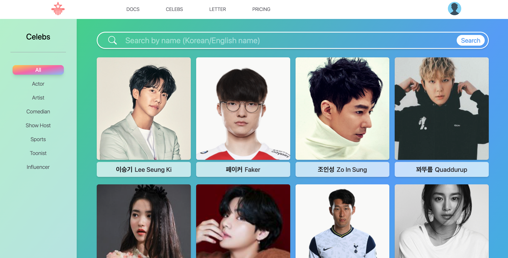
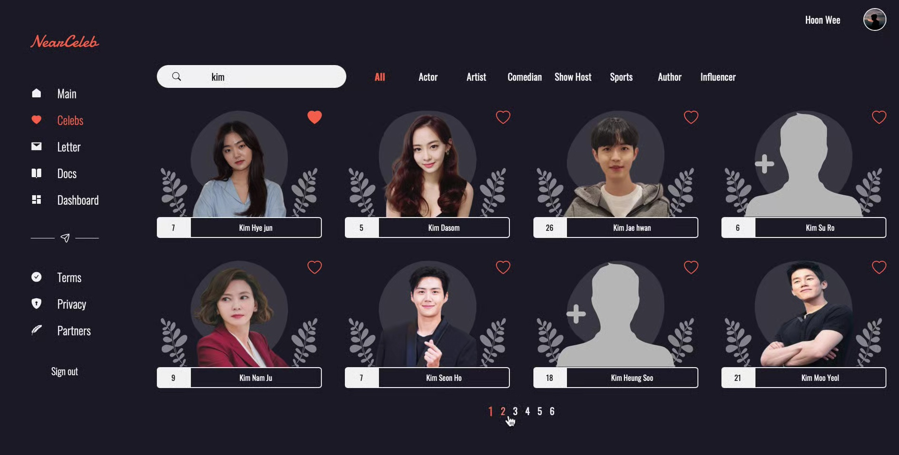
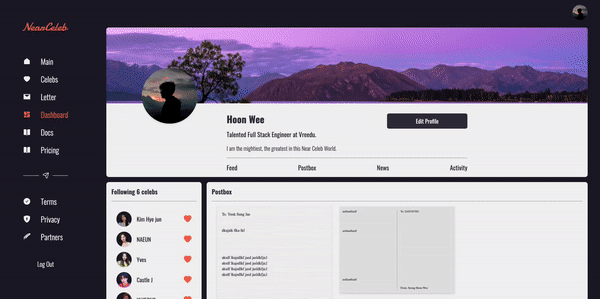
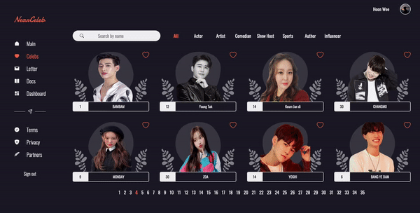
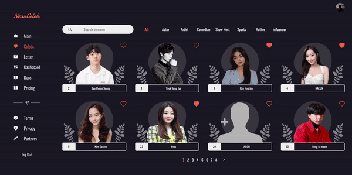

# Near Celeb 

_"They are nearer than you think."_  
  
|First Look|Last Look|
|---|---|
||

## This project is no longer serviced.
*Now this will work as my educational template only*.  
Gosh I worked this for months, really sad now.
But I've learned a lot from this project!

Here are the basic things that (should have) worked in my web service.   

1. Making personal profile  

2. Search Celebs  

3. Write a digital letter  

## How the project is composed
- Deployment  
  - Docker: https://www.docker.com/  
  - Docker-Compose: https://docs.docker.com/compose/ 
- Proxy
  - Nginx: https://www.nginx.com/
  - CertBot: https://certbot.eff.org/
- Database
	- PostgreSQL: https://www.postgresql.org/
	- CertStrap: https://github.com/square/certstrap
- Backend/Serverside
  - NestJS: https://nestjs.com/ 
  - TypeORM: https://typeorm.io/#/
  - Jest: https://jestjs.io/
- Frontend/Clientside
  - NextJS: https://nextjs.org/
  - Apollo GraphQL: https://www.apollographql.com/
  - TailwindCSS: https://tailwindcss.com/
  - Storybook: https://storybook.js.org/
